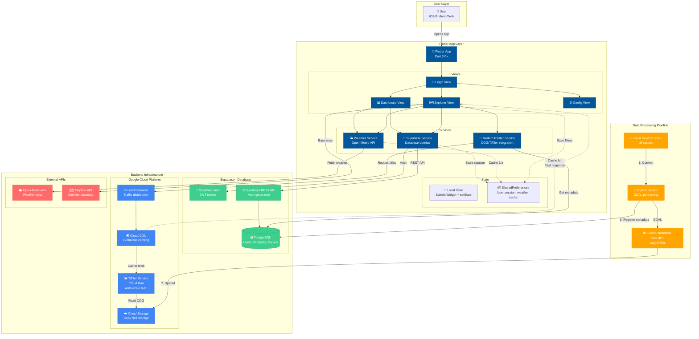
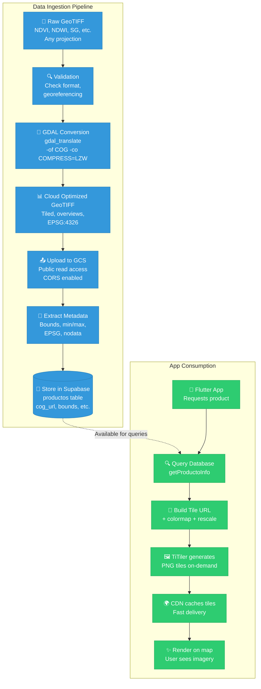
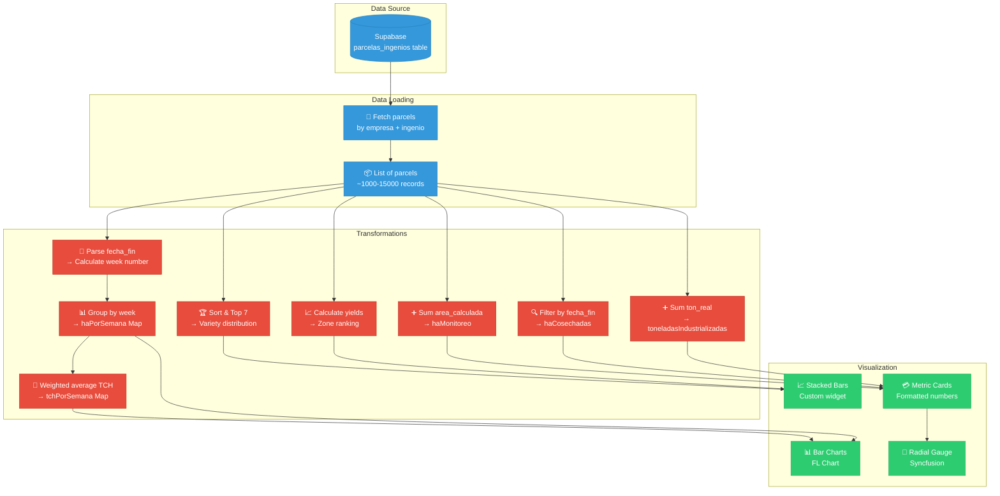
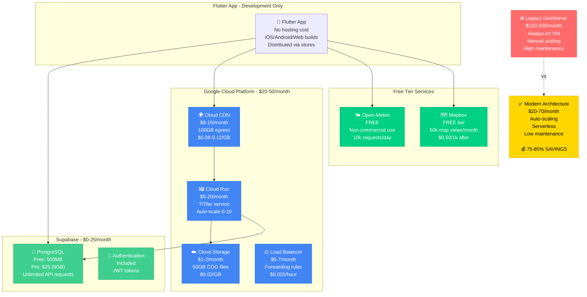
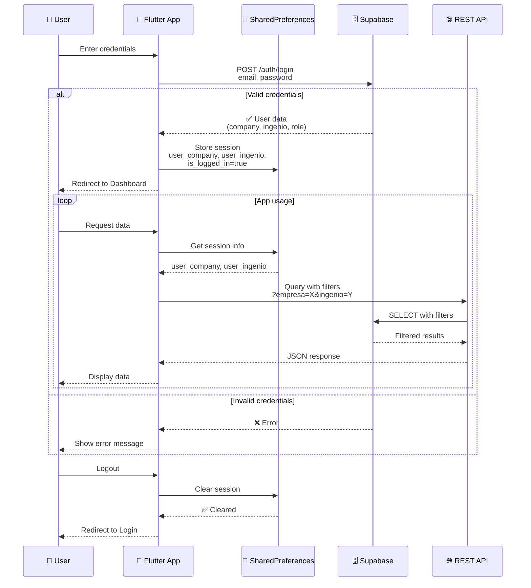
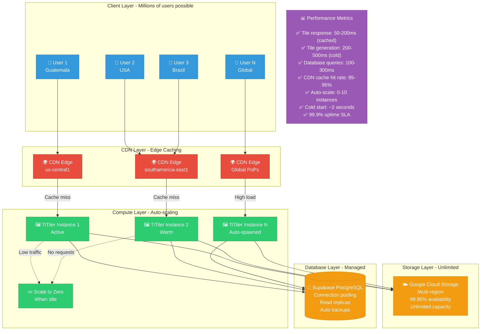
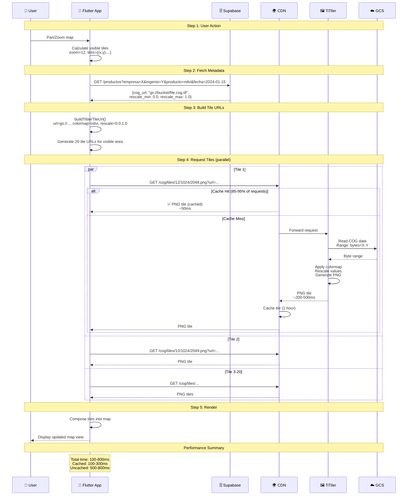
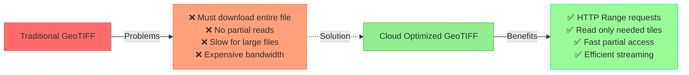

# 🏗️ Techno Analytics - Architecture Diagrams

Complete system architecture with data flow, infrastructure, and component interactions.

---

## 🌐 Complete System Architecture



---

## 📊 Data Flow Diagram

```mermaid
flowchart LR
    subgraph "Data Sources"
        DB[(Supabase DB<br/>productos table)]
        GCS[☁️ GCS Bucket<br/>COG files]
    end

    subgraph "Flutter App Data Flow"
        UserAction[👤 User selects:<br/>Company, Ingenio,<br/>Date, Product]

        FetchMeta[📡 Fetch metadata<br/>getProductoInfo]

        ExtractData[📦 Extract:<br/>• cog_url<br/>• rescale_min/max<br/>• colormap<br/>• bounds]

        BuildURL[🔧 Build TiTiler URL<br/>buildTitilerTileUrl]

        TileRequest[🖼️ Request tiles<br/>/{z}/{x}/{y}.png]

        Render[✨ Render on map<br/>FlutterMap widget]
    end

    subgraph "Backend Processing"
        TiTiler[🎨 TiTiler Service<br/>Cloud Run]
        CDN[🌍 CDN Cache<br/>1 hour TTL]
    end

    %% Flow connections
    UserAction --> FetchMeta
    FetchMeta --> DB
    DB --> ExtractData
    ExtractData --> BuildURL
    BuildURL --> TileRequest
    TileRequest --> CDN
    CDN -->|Cache hit| Render
    CDN -->|Cache miss| TiTiler
    TiTiler --> GCS
    GCS --> TiTiler
    TiTiler --> CDN
    CDN --> Render

    %% Styling
    classDef action fill:#FFE66D,stroke:#f4d03f
    classDef process fill:#4ECDC4,stroke:#45b7aa
    classDef backend fill:#FF6B6B,stroke:#ee5a52

    class UserAction action
    class FetchMeta,ExtractData,BuildURL,TileRequest,Render process
    class TiTiler,CDN backend
```

---

## 🔄 Data Transformation Pipeline



---

## 📊 Dashboard Data Aggregation Flow



---

## 🗺️ Map Rendering Architecture

```mermaid
flowchart TD
    subgraph "Map Layers Stack"
        Layer1[🌍 Layer 1: Satellite Base<br/>Mapbox tiles<br/>OSM alternative]

        Layer2[🎨 Layer 2: COG Raster<br/>TiTiler tiles<br/>NDVI, NDWI, SG, etc.]

        Layer3[📐 Layer 3: Field Parcels<br/>GeoJSON Polygons<br/>zoom >= 10]

        Layer4[📍 Layer 4: Inspections<br/>Marker clusters<br/>Photo points]
    end

    subgraph "Layer 2 Processing"
        A[📡 Get product info<br/>empresa, ingenio,<br/>producto, fecha]

        B[(Supabase<br/>productos table)]

        C[📦 Metadata:<br/>cog_url, colormap,<br/>rescale_min/max]

        D[🔧 Build tile URL<br/>TiTiler endpoint]

        E[🖼️ TileLayer widget<br/>urlTemplate with {z}/{x}/{y}]
    end

    subgraph "Layer 3 Processing"
        F[📡 Get parcels<br/>empresa + ingenio]

        G[(Supabase<br/>parcelas_ingenios)]

        H[📦 GeoJSON data:<br/>geometry_polygon field]

        I[🔄 Parse JSON<br/>Extract coordinates<br/>[[lng,lat],...]]

        J[🔀 Convert to LatLng<br/>Swap to [lat,lng]<br/>Validate bounds]

        K[📐 Create Polygons<br/>Flutter Map widgets<br/>Max 100 points each]

        L[✅ Check zoom level<br/>Render if zoom >= 10]
    end

    subgraph "Rendering"
        M[🗺️ FlutterMap Widget<br/>Combines all layers]

        N[✨ Display on screen<br/>Pan, zoom, interact]
    end

    %% Layer connections
    Layer1 --> M
    Layer2 --> M
    Layer3 --> M
    Layer4 --> M

    %% Layer 2 flow
    A --> B
    B --> C
    C --> D
    D --> E
    E --> Layer2

    %% Layer 3 flow
    F --> G
    G --> H
    H --> I
    I --> J
    J --> K
    K --> L
    L --> Layer3

    M --> N

    %% Styling
    classDef layer fill:#3498db,stroke:#2980b9,color:#fff
    classDef process fill:#e74c3c,stroke:#c0392b,color:#fff
    classDef db fill:#2ecc71,stroke:#27ae60,color:#fff
    classDef render fill:#9b59b6,stroke:#8e44ad,color:#fff

    class Layer1,Layer2,Layer3,Layer4 layer
    class A,C,D,E,F,H,I,J,K,L process
    class B,G db
    class M,N render
```

---

## 🏗️ Infrastructure & Cost Breakdown



---

## 🔐 Authentication & Authorization Flow



---

## 📈 Performance & Scaling Architecture



---

## 🔄 Complete Request Lifecycle



---

## 📝 Architecture Decision Records

### Why Cloud Optimized GeoTIFF (COG)?



### Why TiTiler vs GeoServer?

| Feature | GeoServer | TiTiler |
|---------|-----------|---------|
| **Cost** | $150-250/month | $20-50/month |
| **Scaling** | Manual VM sizing | Auto 0-10 instances |
| **Maintenance** | High (updates, security) | Low (managed service) |
| **Cold Start** | Always warm (expensive) | ~2 seconds (acceptable) |
| **Format Support** | Many formats | COG optimized |
| **Performance** | Good | Excellent with CDN |

---

## 📚 Diagram Legend

| Symbol | Meaning |
|--------|---------|
| 🗄️ | Database |
| ☁️ | Cloud Storage |
| 📱 | Mobile App |
| 🖼️ | Image/Tile Service |
| 🌍 | CDN/Global Distribution |
| 🔐 | Authentication |
| 📊 | Data Processing |
| 🎨 | Rendering/Visualization |
| ⚖️ | Load Balancing |
| 💾 | Caching |

---

**Diagrams Version**: 1.0
**Last Updated**: 2024
**Total Diagrams**: 9

To render these diagrams:
1. Copy any diagram code block
2. Paste into [Mermaid Live Editor](https://mermaid.live)
3. Or view directly in GitHub README/documentation

